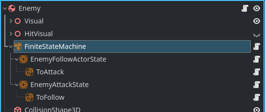
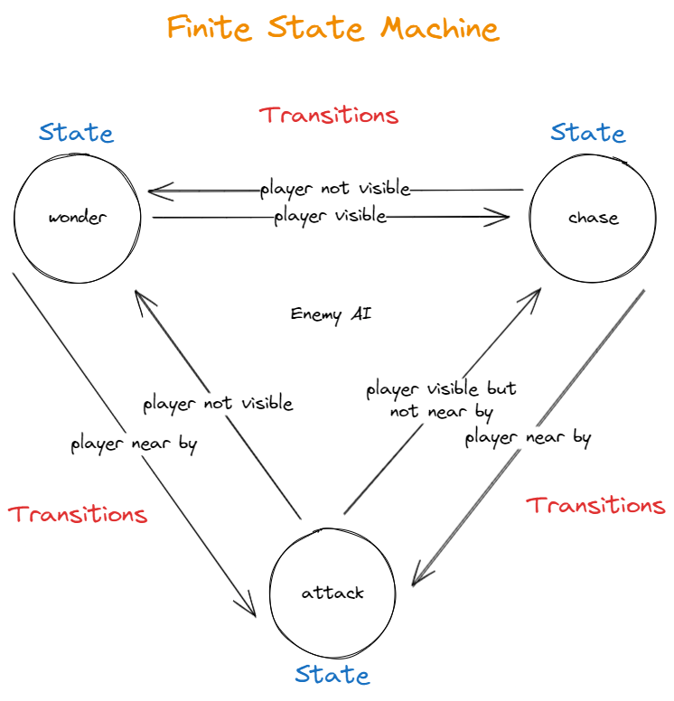
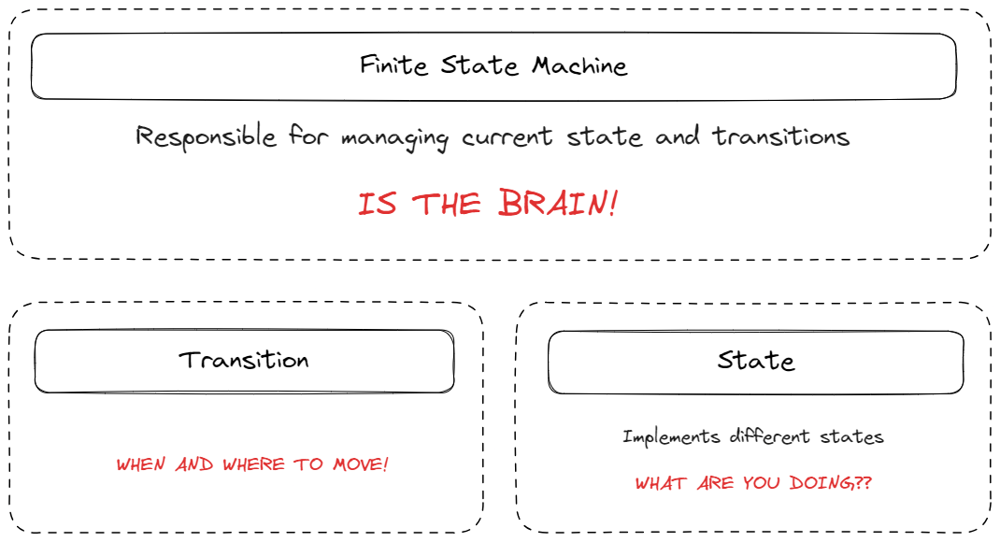

# Node Based Finite State Machine for Godot

## "Allow an object to alter its behaviour when its internal state changes. The object will appear to change its class"

## Requirements:

* Godot 4.0 +

## How to Setup?

1. If it does not yet exists, create a folder called `addons\` in the root of your project
2. Copy the `addons\fsm-godot\` to your `addons\` folder in your project
3. Go to Project -? Project Settings -> Plugins -> And Enable the Plugin
4. Setup is DONE!

## Important Definitions

If you go through the code you will find most of the well commented, but still, here are some important definitions.

**FiniteStateMachine** - Parent class of entire system. It controls what state is the initial and starting state, it is responsible for changing state and maintaining what the current state is. Implements the following methods:
* `func change_state(new_state: State):`
    * Change the current state of the State Machine

**State** - State is the base class where all the state should inherit from and implements the following methods:
* `func enter_state() -> void:`
    * Called when State Machine enters state. Usually used to do any setup.

* `func exit_state() -> void:`
    * Called when State Machine changes from this state to another state.

* `func update(_delta : float) -> void:`
    * Called on every frame. Equivalent to `_process(delta)`

* `func physics_update(_delta : float) -> void:`
    * Called on every physics frame. Equivament to `_physics_process(delta)`

**Transition** - Transition is responsible for validating if a specific condition is true and if so, transition to a specific target state. Implements the following methods:
* `func check_transition() -> bool:`
    * Check if condition is true and returns a bollean.

## How to use?

### This project has a simple example of how to use it. We have a ColorRect node that changes State every 3 seconds controlled by the Finite State Machine.

### Watch the tutorial on my Youtube channel:

#### Here are the basic steps to use it:

1. Add an child node of type FiniteStateMachine as a child of node you want to control with state machine. Example: Enemy. (It can be anything really)
2. Create a new script that inherits from State and give it a class_name, for example `IdleState`
3. Overide and implement the necesary methods depending on what your state should do. Accordinly to the above definitions.
    * If using `func update(_delta : float):`, calling `super.update(_delta)` on top of the method is **mandatory**.
4. Add a child node of Type YourState, example IdleState as a child of the FiniteStateMachine node. And set the Initial state of the FiniteStateMachine to the newly added State, if this will be your initial state.
    * Every State has a property called `Check transition interval`, which is the interval in which the condition for every state should be checked. Default to 1 second.
5. Repeat steps 3 and 4 for every state your Entity needs to have.
6. For every State you added to the FiniteStateMachine you need now to add a child node of type Transition and name it accordinly. I like to follow the pattern of `ToAttack`, `ToIdle`, meaning to are naming the State the transition will move into in case the condition is found true. But feel free to name it whatever you want.
7. For every Transition you add you need to fill in the following parameters:
    * **Target State** - Represents the State node this transtion will move the FiniteStateMachine into in case of condition is found true.
    * **Variable Name** - Exact match of variable name to be monitored in the parent State this transition is under. 
    * **Operator** - How you would like this variable to be compared. LESS THAN, EQUAL, MORE THAN.
    * **Value Type** - What is the type of the variable? Type accepted at this point are: INT, FLOAT. BOOLEAN. (Will add more in the future)
    * **Value** - Value to compare the variable against.

### Contributing
**Pull requests are warmly welcome!!!**

For major changes, please [open an issue](https://github.com/joaoh82/fsm-godot/issues/new) first and let's talk about it. We are all ears!

If you'd like to contribute, please fork the repository and make changes as you'd like and shoot a Pull Request our way!

**Please make sure to update tests as appropriate.**

If you feel like you need it go check the GitHub documentation on [creating a pull request](https://help.github.com/en/github/collaborating-with-issues-and-pull-requests/creating-a-pull-request).

### Code of Conduct

Contribution to the project is organized under the terms of the
Contributor Covenant, the maintainer of Screen Console, [@joaoh82](https://github.com/joaoh82), promises to
intervene to uphold that code of conduct.

### Contact

If you want to contact me you can reach me at <joaoh82@gmail.com>.
